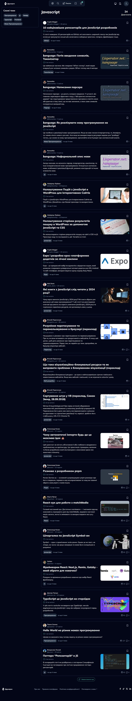
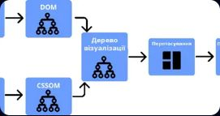
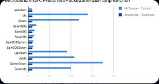
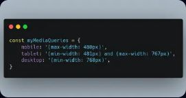
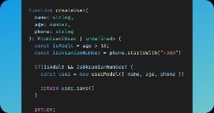
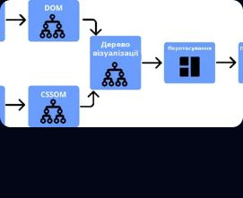
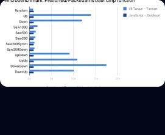
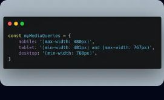
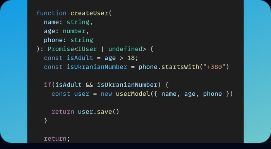

# https://drukarnia.com.ua/themes/javascript

Report created at 7/7/2024

## Test environment

- Browser: Mozilla/5.0 (Windows NT 10.0; Win64; x64) AppleWebKit/537.36 (KHTML, like Gecko) Chrome/127.0.6533.17 Safari/537.36 Edg/127.0.6533.17
- Resolution: 1280x720

## Compliance with standards

Not satisfy the requirements for:

- [EN 301 549](https://www.etsi.org/deliver/etsi_en/301500_301599/301549/03.02.01_60/en_301549v030201p.pdf)
- [WCAG 2.0 Level A](https://www.w3.org/TR/WCAG20/)

## Violations

### ARIA role should be appropriate for the element

Ensures role attribute has an appropriate value for the element

Impact: **minor**

Need to fix one of the following issues:

- ARIA role presentation is not allowed for given element.

Affected elements:

- `article[aria-labelledby="66105387e6363e315a828c5f-title"] > .gap-x-5.gap-y-2.md\:flex-row > .md\:w-1\/3.shrink-0 > .aspect-image-preview.h-auto.object-cover`

	
- `article[aria-labelledby="66104b2ce6363e315a827267-title"] > .gap-x-5.gap-y-2.md\:flex-row > .md\:w-1\/3.shrink-0 > .aspect-image-preview.h-auto.object-cover`

	
- `article[aria-labelledby="66104432e6363e315a825bd1-title"] > .gap-x-5.gap-y-2.md\:flex-row > .md\:w-1\/3.shrink-0 > .aspect-image-preview.h-auto.object-cover`

	
- `article[aria-labelledby="65f5e88fe6363e315a3c5c33-title"] > .gap-x-5.gap-y-2.md\:flex-row > .md\:w-1\/3.shrink-0 > .aspect-image-preview.h-auto.object-cover`

	
- `article[aria-labelledby="65f39900e6363e315a380509-title"] > .gap-x-5.gap-y-2.md\:flex-row > .md\:w-1\/3.shrink-0 > .aspect-image-preview.h-auto.object-cover`

	
- `article[aria-labelledby="65d9dad8e6363e315af78a65-title"] > .gap-x-5.gap-y-2.md\:flex-row > .md\:w-1\/3.shrink-0 > .aspect-image-preview.h-auto.object-cover`

	
- `article[aria-labelledby="65d3795fe6363e315ae6864c-title"] > .gap-x-5.gap-y-2.md\:flex-row > .md\:w-1\/3.shrink-0 > .aspect-image-preview.h-auto.object-cover`

	
- `article[aria-labelledby="653cfadf4e72162e1503b7b8-title"] > .gap-x-5.gap-y-2.md\:flex-row > .md\:w-1\/3.shrink-0 > .aspect-image-preview.h-auto.object-cover`

	
- `article[aria-labelledby="64db4605280f44210228586c-title"] > .gap-x-5.gap-y-2.md\:flex-row > .md\:w-1\/3.shrink-0 > .aspect-image-preview.h-auto.object-cover`

	
- `article[aria-labelledby="6494b136280f442102e4ee6b-title"] > .gap-x-5.gap-y-2.md\:flex-row > .md\:w-1\/3.shrink-0 > .aspect-image-preview.h-auto.object-cover`

	
- `article[aria-labelledby="6491631f280f442102e0cdb3-title"] > .gap-x-5.gap-y-2.md\:flex-row > .md\:w-1\/3.shrink-0 > .aspect-image-preview.h-auto.object-cover`

	
- `article[aria-labelledby="648c8456280f442102da7f39-title"] > .gap-x-5.gap-y-2.md\:flex-row > .md\:w-1\/3.shrink-0 > .aspect-image-preview.h-auto.object-cover`

	
- `article[aria-labelledby="648c5888280f442102da3d40-title"] > .gap-x-5.gap-y-2.md\:flex-row > .md\:w-1\/3.shrink-0 > .aspect-image-preview.h-auto.object-cover`

	
- `article[aria-labelledby="647c2408fb6c8702220c01f6-title"] > .gap-x-5.gap-y-2.md\:flex-row > .md\:w-1\/3.shrink-0 > .aspect-image-preview.h-auto.object-cover`

	
- `article[aria-labelledby="647656811da86b937cc4944b-title"] > .gap-x-5.gap-y-2.md\:flex-row > .md\:w-1\/3.shrink-0 > .aspect-image-preview.h-auto.object-cover`

	
- `article[aria-labelledby="6447e9ae38cd2dd0b1cf9858-title"] > .gap-x-5.gap-y-2.md\:flex-row > .md\:w-1\/3.shrink-0 > .aspect-image-preview.h-auto.object-cover`

	

### ARIA commands must have an accessible name

Ensures every ARIA button, link and menuitem has an accessible name

Impact: **serious**

Required to satisfy [WCAG 2.0 Level A](https://www.w3.org/TR/WCAG20/), [EN 301 549](https://www.etsi.org/deliver/etsi_en/301500_301599/301549/03.02.01_60/en_301549v030201p.pdf)

Need to fix one of the following issues:

- Element does not have text that is visible to screen readers.
- aria-label attribute does not exist or is empty.
- aria-labelledby attribute does not exist, references elements that do not exist or references elements that are empty.
- Element has no title attribute.

Affected elements:

- `#headlessui-menu-button-5`

	
- `#headlessui-popover-button-400528`

	

### Buttons must have discernible text

Ensures buttons have discernible text

Impact: **critical**

Required to satisfy [WCAG 2.0 Level A](https://www.w3.org/TR/WCAG20/), [EN 301 549](https://www.etsi.org/deliver/etsi_en/301500_301599/301549/03.02.01_60/en_301549v030201p.pdf)

Need to fix one of the following issues:

- Element does not have inner text that is visible to screen readers.
- aria-label attribute does not exist or is empty.
- aria-labelledby attribute does not exist, references elements that do not exist or references elements that are empty.
- Element has no title attribute.
- Element&#039;s default semantics were not overridden with role=&quot;none&quot; or role=&quot;presentation&quot;.

Affected elements:

- `#headlessui-menu-button-5 > .text-base.p-2\.5.dark\:hover\:bg-primary-800`

	
- `.grow > .text-base.p-2\.5.dark\:hover\:bg-primary-800`

	
- `#headlessui-popover-button-400528 > .hover\:bg-white.dark\:hover\:bg-gray-900.text-gray-900`

	

### Ensures landmarks are unique

Landmarks should have a unique role or role/label/title (i.e. accessible name) combination

Impact: **moderate**

Need to fix one of the following issues:

- The landmark must have a unique aria-label, aria-labelledby, or title to make landmarks distinguishable.

Affected elements:

- `section[aria-labelledby="semantic-section-858447"]`

	

### Links must have discernible text

Ensures links have discernible text

Impact: **serious**

Required to satisfy [WCAG 2.0 Level A](https://www.w3.org/TR/WCAG20/), [EN 301 549](https://www.etsi.org/deliver/etsi_en/301500_301599/301549/03.02.01_60/en_301549v030201p.pdf)

Need to fix all the following issues:

- Element is in tab order and does not have accessible text.Need to fix one of the following issues:

- Element does not have text that is visible to screen readers.
- aria-label attribute does not exist or is empty.
- aria-labelledby attribute does not exist, references elements that do not exist or references elements that are empty.
- Element has no title attribute.

Affected elements:

- `article[aria-labelledby="66105387e6363e315a828c5f-title"] > .gap-x-5.gap-y-2.md\:flex-row > .md\:w-1\/3.shrink-0`

	
- `article[aria-labelledby="66104b2ce6363e315a827267-title"] > .gap-x-5.gap-y-2.md\:flex-row > .md\:w-1\/3.shrink-0`

	
- `article[aria-labelledby="66104432e6363e315a825bd1-title"] > .gap-x-5.gap-y-2.md\:flex-row > .md\:w-1\/3.shrink-0`

	
- `article[aria-labelledby="65f5e88fe6363e315a3c5c33-title"] > .gap-x-5.gap-y-2.md\:flex-row > .md\:w-1\/3.shrink-0`

	
- `article[aria-labelledby="65f39900e6363e315a380509-title"] > .gap-x-5.gap-y-2.md\:flex-row > .md\:w-1\/3.shrink-0`

	
- `article[aria-labelledby="65d9dad8e6363e315af78a65-title"] > .gap-x-5.gap-y-2.md\:flex-row > .md\:w-1\/3.shrink-0`

	
- `article[aria-labelledby="65d3795fe6363e315ae6864c-title"] > .gap-x-5.gap-y-2.md\:flex-row > .md\:w-1\/3.shrink-0`

	
- `article[aria-labelledby="653cfadf4e72162e1503b7b8-title"] > .gap-x-5.gap-y-2.md\:flex-row > .md\:w-1\/3.shrink-0`

	
- `article[aria-labelledby="64db4605280f44210228586c-title"] > .gap-x-5.gap-y-2.md\:flex-row > .md\:w-1\/3.shrink-0`

	
- `article[aria-labelledby="6494b136280f442102e4ee6b-title"] > .gap-x-5.gap-y-2.md\:flex-row > .md\:w-1\/3.shrink-0`

	
- `article[aria-labelledby="6491631f280f442102e0cdb3-title"] > .gap-x-5.gap-y-2.md\:flex-row > .md\:w-1\/3.shrink-0`

	
- `article[aria-labelledby="648c8456280f442102da7f39-title"] > .gap-x-5.gap-y-2.md\:flex-row > .md\:w-1\/3.shrink-0`

	
- `article[aria-labelledby="648c5888280f442102da3d40-title"] > .gap-x-5.gap-y-2.md\:flex-row > .md\:w-1\/3.shrink-0`

	
- `article[aria-labelledby="647c2408fb6c8702220c01f6-title"] > .gap-x-5.gap-y-2.md\:flex-row > .md\:w-1\/3.shrink-0`

	
- `article[aria-labelledby="647656811da86b937cc4944b-title"] > .gap-x-5.gap-y-2.md\:flex-row > .md\:w-1\/3.shrink-0`

	
- `article[aria-labelledby="6447e9ae38cd2dd0b1cf9858-title"] > .gap-x-5.gap-y-2.md\:flex-row > .md\:w-1\/3.shrink-0`

	

### Interactive controls must not be nested

Ensures interactive controls are not nested as they are not always announced by screen readers or can cause focus problems for assistive technologies

Impact: **serious**

Required to satisfy [WCAG 2.0 Level A](https://www.w3.org/TR/WCAG20/), [EN 301 549](https://www.etsi.org/deliver/etsi_en/301500_301599/301549/03.02.01_60/en_301549v030201p.pdf)

Need to fix one of the following issues:

- Element has focusable descendants.

Affected elements:

- `#headlessui-popover-button-400526`

	
- `#headlessui-menu-button-5`

	
- `#headlessui-popover-button-400528`

	

