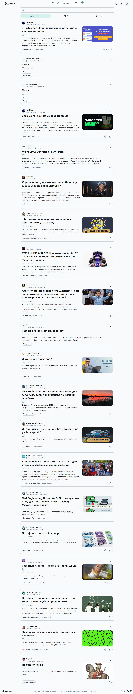
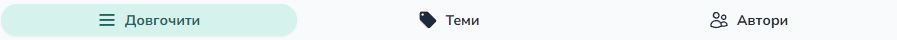

# https://drukarnia.com.ua/search?text=%D1%82%D0%B5%D1%81%D1%82

Report created at 7/7/2024

## Test environment

- Browser: Mozilla/5.0 (Windows NT 10.0; Win64; x64) AppleWebKit/537.36 (KHTML, like Gecko) Chrome/127.0.6533.17 Safari/537.36 Edg/127.0.6533.17
- Resolution: 1280x720

## Compliance with standards

Not satisfy the requirements for:

- [EN 301 549](https://www.etsi.org/deliver/etsi_en/301500_301599/301549/03.02.01_60/en_301549v030201p.pdf)
- [WCAG 2.0 Level A](https://www.w3.org/TR/WCAG20/)

## Violations

### ARIA commands must have an accessible name

Ensures every ARIA button, link and menuitem has an accessible name

Impact: **serious**

Required to satisfy [WCAG 2.0 Level A](https://www.w3.org/TR/WCAG20/), [EN 301 549](https://www.etsi.org/deliver/etsi_en/301500_301599/301549/03.02.01_60/en_301549v030201p.pdf)

Need to fix one of the following issues:

- Element does not have text that is visible to screen readers.
- aria-label attribute does not exist or is empty.
- aria-labelledby attribute does not exist, references elements that do not exist or references elements that are empty.
- Element has no title attribute.

Affected elements:

- `#headlessui-popover-button-406778`

	

### ARIA hidden element must not be focusable or contain focusable elements

Ensures aria-hidden elements are not focusable nor contain focusable elements

Impact: **serious**

Required to satisfy [WCAG 2.0 Level A](https://www.w3.org/TR/WCAG20/), [EN 301 549](https://www.etsi.org/deliver/etsi_en/301500_301599/301549/03.02.01_60/en_301549v030201p.pdf)

Need to fix all the following issues:

- Focusable content should be disabled or be removed from the DOM.

Affected elements:

- `:root`

	

### Buttons must have discernible text

Ensures buttons have discernible text

Impact: **critical**

Required to satisfy [WCAG 2.0 Level A](https://www.w3.org/TR/WCAG20/), [EN 301 549](https://www.etsi.org/deliver/etsi_en/301500_301599/301549/03.02.01_60/en_301549v030201p.pdf)

Need to fix one of the following issues:

- Element does not have inner text that is visible to screen readers.
- aria-label attribute does not exist or is empty.
- aria-labelledby attribute does not exist, references elements that do not exist or references elements that are empty.
- Element has no title attribute.
- Element&#039;s default semantics were not overridden with role=&quot;none&quot; or role=&quot;presentation&quot;.

Affected elements:

- `.grow > .text-base`

	
- `.text-gray-900.hover\:bg-white[type="button"]`

	

### Document should have one main landmark

Ensures the document has a main landmark

Impact: **moderate**

Need to fix all the following issues:

- Document does not have a main landmark.

Affected elements:

- html

### Interactive controls must not be nested

Ensures interactive controls are not nested as they are not always announced by screen readers or can cause focus problems for assistive technologies

Impact: **serious**

Required to satisfy [WCAG 2.0 Level A](https://www.w3.org/TR/WCAG20/), [EN 301 549](https://www.etsi.org/deliver/etsi_en/301500_301599/301549/03.02.01_60/en_301549v030201p.pdf)

Need to fix one of the following issues:

- Element has focusable descendants.

Affected elements:

- `#headlessui-popover-button-406776`

	
- `#headlessui-popover-button-406778`

	

### Page should contain a level-one heading

Ensure that the page, or at least one of its frames contains a level-one heading

Impact: **moderate**

Need to fix all the following issues:

- Page must have a level-one heading.

Affected elements:

- html

### All page content should be contained by landmarks

Ensures all page content is contained by landmarks

Impact: **moderate**

Need to fix one of the following issues:

- Some page content is not contained by landmarks.

Affected elements:

- `.space-y-2.relative > .bg-transparent`

	

