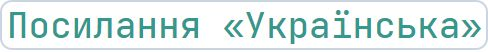
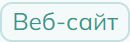

# https://drukarnia.com.ua/articles/pro-dostupnist-ta-ui-na-prikladi-mogo-osobistogo-saitu-SUBxk

Report created at 7/7/2024

## Test environment

- Browser: Mozilla/5.0 (iPad; CPU OS 12_2 like Mac OS X) AppleWebKit/605.1.15 (KHTML, like Gecko) Version/17.4 Mobile/15E148 Safari/604.1
- Resolution: 834x1194

## Compliance with standards

Not satisfy the requirements for:

- [EN 301 549](https://www.etsi.org/deliver/etsi_en/301500_301599/301549/03.02.01_60/en_301549v030201p.pdf)
- [WCAG 2.0 Level A](https://www.w3.org/TR/WCAG20/)
- [WCAG 2.0 Level AA](https://www.w3.org/TR/WCAG20/)

## Violations

### ARIA role should be appropriate for the element

Ensures role attribute has an appropriate value for the element

Impact: **minor**

Need to fix one of the following issues:

- ARIA role presentation is not allowed for given element.

Affected elements:

- `img[loading="eager"]`

	
- `img[width="590"][height="947"][loading="lazy"]`

	
- `img[height="522"]`

	
- `img[height="677"]`

	
- `img[height="547"]`

	
- `img[height="578"]`

	
- `img[height="247"]`

	

### ARIA commands must have an accessible name

Ensures every ARIA button, link and menuitem has an accessible name

Impact: **serious**

Required to satisfy [WCAG 2.0 Level A](https://www.w3.org/TR/WCAG20/), [EN 301 549](https://www.etsi.org/deliver/etsi_en/301500_301599/301549/03.02.01_60/en_301549v030201p.pdf)

Need to fix one of the following issues:

- Element does not have text that is visible to screen readers.
- aria-label attribute does not exist or is empty.
- aria-labelledby attribute does not exist, references elements that do not exist or references elements that are empty.
- Element has no title attribute.

Affected elements:

- `#headlessui-popover-button-393126`

	
- `#headlessui-menu-button-393131`

	

### Elements must only use permitted ARIA attributes

Ensures ARIA attributes are not prohibited for an element&#039;s role

Impact: **serious**

Required to satisfy [WCAG 2.0 Level A](https://www.w3.org/TR/WCAG20/), [EN 301 549](https://www.etsi.org/deliver/etsi_en/301500_301599/301549/03.02.01_60/en_301549v030201p.pdf)

Need to fix all the following issues:

- aria-label attribute cannot be used on a div with no valid role attribute..

Affected elements:

- `.mt-4 > .profile.rounded-2xl.bg-brand-light > .profile-info-container.border-b.text-center > .actions.flex-wrap.justify-center > .share-button.right-4.top-4 > .text-left.rtl\:text-right[data-headlessui-state=""]`

	

### Buttons must have discernible text

Ensures buttons have discernible text

Impact: **critical**

Required to satisfy [WCAG 2.0 Level A](https://www.w3.org/TR/WCAG20/), [EN 301 549](https://www.etsi.org/deliver/etsi_en/301500_301599/301549/03.02.01_60/en_301549v030201p.pdf)

Need to fix one of the following issues:

- Element does not have inner text that is visible to screen readers.
- aria-label attribute does not exist or is empty.
- aria-labelledby attribute does not exist, references elements that do not exist or references elements that are empty.
- Element has no title attribute.
- Element&#039;s default semantics were not overridden with role=&quot;none&quot; or role=&quot;presentation&quot;.

Affected elements:

- `.text-base`

	
- `#headlessui-popover-button-393126 > button`

	
- `#headlessui-menu-button-393131 > .hover\:bg-primary-50.dark\:hover\:bg-primary-800`

	

### Elements must meet minimum color contrast ratio thresholds

Ensures the contrast between foreground and background colors meets WCAG 2 AA minimum contrast ratio thresholds

Impact: **serious**

Required to satisfy [WCAG 2.0 Level AA](https://www.w3.org/TR/WCAG20/), [EN 301 549](https://www.etsi.org/deliver/etsi_en/301500_301599/301549/03.02.01_60/en_301549v030201p.pdf)

Need to fix one of the following issues:

- Element has insufficient color contrast of 3.48 (foreground color: #34988e, background color: #ffffff, font size: 13.5pt (18px), font weight: normal). Expected contrast ratio of 4.5:1.

Affected elements:

- `p:nth-child(18) > code`

	
- `p:nth-child(21) > code`

	
- `p:nth-child(30) > code`

	
- `p:nth-child(32) > code:nth-child(1)`

	
- `p:nth-child(32) > code:nth-child(2)`

	
- `code:nth-child(3)`

	
- `em > code:nth-child(1)`

	
- `em > code:nth-child(2)`

	

Need to fix one of the following issues:

- Element has insufficient color contrast of 4.33 (foreground color: #64748b, background color: #edf6f6, font size: 12.0pt (16px), font weight: normal). Expected contrast ratio of 4.5:1.

Affected elements:

- `.mt-4 > .profile.rounded-2xl.bg-brand-light > .profile-info-container.border-b.text-center > .profile-info.flex-col.justify-center > div > .text-gray-500.dark\:text-gray-400`

	

Need to fix one of the following issues:

- Element has insufficient color contrast of 4.33 (foreground color: #64748b, background color: #edf6f6, font size: 10.5pt (14px), font weight: normal). Expected contrast ratio of 4.5:1.

Affected elements:

- `.mt-4 > .profile.rounded-2xl.bg-brand-light > .profile-info-container.border-b.text-center > .profile-info.flex-col.justify-center > div > .profile-stats.my-6.max-w-xs > .mr-6.flex-col[title="5261"] > .font-semibold.text-gray-500.dark\:text-gray-400`

	
- `.mt-4 > .profile.rounded-2xl.bg-brand-light > .profile-info-container.border-b.text-center > .profile-info.flex-col.justify-center > div > .profile-stats.my-6.max-w-xs > .border-x.border-gray-300.px-6 > .font-semibold.text-gray-500.dark\:text-gray-400`

	
- `.mt-4 > .profile.rounded-2xl.bg-brand-light > .profile-info-container.border-b.text-center > .profile-info.flex-col.justify-center > div > .profile-stats.my-6.max-w-xs > .ml-6.text-inherit.flex-col > .font-semibold.text-gray-500.dark\:text-gray-400`

	
- `.mt-4 > .profile.rounded-2xl.bg-brand-light > .m-3.gap-x-16.gap-y-2 > .gap-1.text-gray-500.dark\:text-gray-400`

	

Need to fix one of the following issues:

- Element has insufficient color contrast of 3.29 (foreground color: #34988e, background color: #f3faf9, font size: 9.0pt (12px), font weight: normal). Expected contrast ratio of 4.5:1.

Affected elements:

- `section[aria-labelledby="semantic-section-842417"] > .hover\:bg-white.dark\:hover\:bg-gray-900[href$="ui-ux"] > .px-1\.5.py-0\.5.bg-primary-50`

	
- `section[aria-labelledby="semantic-section-842418"] > .hover\:bg-white.dark\:hover\:bg-gray-900[href$="css"] > .px-1\.5.py-0\.5.bg-primary-50`

	
- `section[aria-labelledby="semantic-section-842419"] > .hover\:bg-white.dark\:hover\:bg-gray-900[href$="javascript"] > .px-1\.5.py-0\.5.bg-primary-50`

	
- `section[aria-labelledby="semantic-section-842421"] > .hover\:bg-white.dark\:hover\:bg-gray-900[href$="ui-ux"] > .px-1\.5.py-0\.5.bg-primary-50`

	
- `section[aria-labelledby="semantic-section-842422"] > .hover\:bg-white.dark\:hover\:bg-gray-900[href$="stvorennya-saitiv"] > .px-1\.5.py-0\.5.bg-primary-50`

	
- `section[aria-labelledby="semantic-section-842423"] > .hover\:bg-white.dark\:hover\:bg-gray-900[href$="veb-sait"] > .px-1\.5.py-0\.5.bg-primary-50`

	

### Alternative text of images should not be repeated as text

Ensure image alternative is not repeated as text

Impact: **minor**

Need to fix all the following issues:

- Element contains &lt;img&gt; element with alt text that duplicates existing text.

Affected elements:

- `.h-12.w-12[alt="Олександр Козак"]`

	

### Ensures landmarks are unique

Landmarks should have a unique role or role/label/title (i.e. accessible name) combination

Impact: **moderate**

Need to fix one of the following issues:

- The landmark must have a unique aria-label, aria-labelledby, or title to make landmarks distinguishable.

Affected elements:

- `section[aria-labelledby="semantic-section-842417"]`

	

### Interactive controls must not be nested

Ensures interactive controls are not nested as they are not always announced by screen readers or can cause focus problems for assistive technologies

Impact: **serious**

Required to satisfy [WCAG 2.0 Level A](https://www.w3.org/TR/WCAG20/), [EN 301 549](https://www.etsi.org/deliver/etsi_en/301500_301599/301549/03.02.01_60/en_301549v030201p.pdf)

Need to fix one of the following issues:

- Element has focusable descendants.

Affected elements:

- `#headlessui-popover-button-393124`

	
- `#headlessui-popover-button-393126`

	
- `#headlessui-popover-button-393129`

	
- `#headlessui-menu-button-393131`

	

