# https://drukarnia.com.ua/kozack

Report created at 7/7/2024

## Test environment

- Browser: Mozilla/5.0 (iPad; CPU OS 12_2 like Mac OS X) AppleWebKit/605.1.15 (KHTML, like Gecko) Version/17.4 Mobile/15E148 Safari/604.1
- Resolution: 834x1194

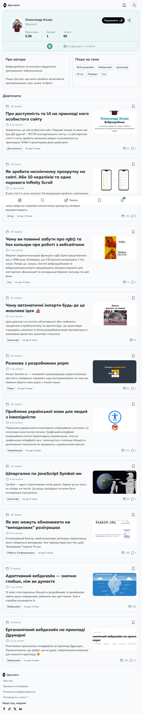

## Compliance with standards

Not satisfy the requirements for:

- [EN 301 549](https://www.etsi.org/deliver/etsi_en/301500_301599/301549/03.02.01_60/en_301549v030201p.pdf)
- [WCAG 2.0 Level A](https://www.w3.org/TR/WCAG20/)
- [WCAG 2.0 Level AA](https://www.w3.org/TR/WCAG20/)

## Violations

### ARIA role should be appropriate for the element

Ensures role attribute has an appropriate value for the element

Impact: **minor**

Need to fix one of the following issues:

- ARIA role presentation is not allowed for given element.

Affected elements:

- `article[aria-labelledby="6649bf1ae6363e315a60a765-title"] > .gap-x-5.gap-y-2.md\:flex-row > .shrink-0.md\:w-1\/3 > .aspect-image-preview.h-auto.object-cover`

	
- `article[aria-labelledby="64b40b08280f44210202a9ff-title"] > .gap-x-5.gap-y-2.md\:flex-row > .shrink-0.md\:w-1\/3 > .aspect-image-preview.h-auto.object-cover`

	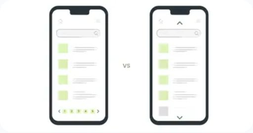
- `article[aria-labelledby="649d69e3280f442102ecbaf7-title"] > .gap-x-5.gap-y-2.md\:flex-row > .shrink-0.md\:w-1\/3 > .aspect-image-preview.h-auto.object-cover`

	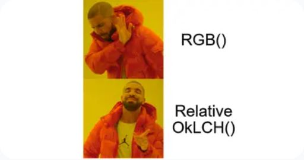
- `article[aria-labelledby="6494b136280f442102e4ee6b-title"] > .gap-x-5.gap-y-2.md\:flex-row > .shrink-0.md\:w-1\/3 > .aspect-image-preview.h-auto.object-cover`

	
- `article[aria-labelledby="6491631f280f442102e0cdb3-title"] > .gap-x-5.gap-y-2.md\:flex-row > .shrink-0.md\:w-1\/3 > .aspect-image-preview.h-auto.object-cover`

	
- `article[aria-labelledby="648c8be7280f442102da8e21-title"] > .gap-x-5.gap-y-2.md\:flex-row > .shrink-0.md\:w-1\/3 > .aspect-image-preview.h-auto.object-cover`

	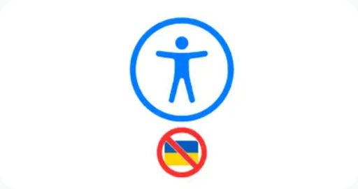
- `article[aria-labelledby="648c5888280f442102da3d40-title"] > .gap-x-5.gap-y-2.md\:flex-row > .shrink-0.md\:w-1\/3 > .aspect-image-preview.h-auto.object-cover`

	
- `article[aria-labelledby="6470e3a3c149c83ef753c0b7-title"] > .gap-x-5.gap-y-2.md\:flex-row > .shrink-0.md\:w-1\/3 > .aspect-image-preview.h-auto.object-cover`

	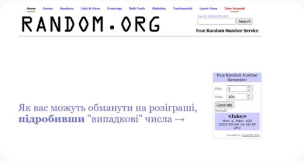
- `article[aria-labelledby="645903d1c149c83ef73715d8-title"] > .gap-x-5.gap-y-2.md\:flex-row > .shrink-0.md\:w-1\/3 > .aspect-image-preview.h-auto.object-cover`

	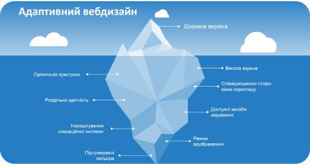
- `article[aria-labelledby="644e85be7305cb90edb048e8-title"] > .gap-x-5.gap-y-2.md\:flex-row > .shrink-0.md\:w-1\/3 > .aspect-image-preview.h-auto.object-cover`

	

### ARIA commands must have an accessible name

Ensures every ARIA button, link and menuitem has an accessible name

Impact: **serious**

Required to satisfy [WCAG 2.0 Level A](https://www.w3.org/TR/WCAG20/), [EN 301 549](https://www.etsi.org/deliver/etsi_en/301500_301599/301549/03.02.01_60/en_301549v030201p.pdf)

Need to fix one of the following issues:

- Element does not have text that is visible to screen readers.
- aria-label attribute does not exist or is empty.
- aria-labelledby attribute does not exist, references elements that do not exist or references elements that are empty.
- Element has no title attribute.

Affected elements:

- `#headlessui-popover-button-405998`

	

### Certain ARIA roles must contain particular children

Ensures elements with an ARIA role that require child roles contain them

Impact: **critical**

Required to satisfy [WCAG 2.0 Level A](https://www.w3.org/TR/WCAG20/), [EN 301 549](https://www.etsi.org/deliver/etsi_en/301500_301599/301549/03.02.01_60/en_301549v030201p.pdf)

Need to fix one of the following issues:

- Element has children which are not allowed: ul[tabindex].

Affected elements:

- `div[role="feed"]`

	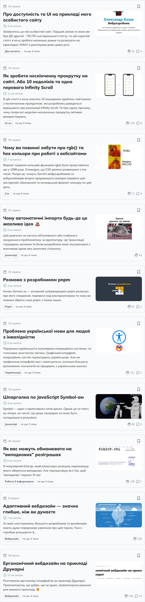

### Buttons must have discernible text

Ensures buttons have discernible text

Impact: **critical**

Required to satisfy [WCAG 2.0 Level A](https://www.w3.org/TR/WCAG20/), [EN 301 549](https://www.etsi.org/deliver/etsi_en/301500_301599/301549/03.02.01_60/en_301549v030201p.pdf)

Need to fix one of the following issues:

- Element does not have inner text that is visible to screen readers.
- aria-label attribute does not exist or is empty.
- aria-labelledby attribute does not exist, references elements that do not exist or references elements that are empty.
- Element has no title attribute.
- Element&#039;s default semantics were not overridden with role=&quot;none&quot; or role=&quot;presentation&quot;.

Affected elements:

- `.text-base`

	
- `#headlessui-popover-button-405998 > .text-gray-900.hover\:bg-white.dark\:hover\:bg-gray-900`

	

### Elements must meet minimum color contrast ratio thresholds

Ensures the contrast between foreground and background colors meets WCAG 2 AA minimum contrast ratio thresholds

Impact: **serious**

Required to satisfy [WCAG 2.0 Level AA](https://www.w3.org/TR/WCAG20/), [EN 301 549](https://www.etsi.org/deliver/etsi_en/301500_301599/301549/03.02.01_60/en_301549v030201p.pdf)

Need to fix one of the following issues:

- Element has insufficient color contrast of 4.33 (foreground color: #64748b, background color: #edf6f6, font size: 12.0pt (16px), font weight: normal). Expected contrast ratio of 4.5:1.

Affected elements:

- `.md\:items-start > div > .text-gray-500.dark\:text-gray-400`

	

Need to fix one of the following issues:

- Element has insufficient color contrast of 4.33 (foreground color: #64748b, background color: #edf6f6, font size: 10.5pt (14px), font weight: normal). Expected contrast ratio of 4.5:1.

Affected elements:

- `.mr-6 > .font-semibold.text-gray-500.dark\:text-gray-400`

	
- `.border-x > .font-semibold.text-gray-500.dark\:text-gray-400`

	
- `.ml-6 > .font-semibold.text-gray-500.dark\:text-gray-400`

	
- `.gap-1.text-gray-500.dark\:text-gray-400`

	

### Ensures landmarks are unique

Landmarks should have a unique role or role/label/title (i.e. accessible name) combination

Impact: **moderate**

Need to fix one of the following issues:

- The landmark must have a unique aria-label, aria-labelledby, or title to make landmarks distinguishable.

Affected elements:

- `section[aria-labelledby="semantic-section-870139"]`

	

### Links must have discernible text

Ensures links have discernible text

Impact: **serious**

Required to satisfy [WCAG 2.0 Level A](https://www.w3.org/TR/WCAG20/), [EN 301 549](https://www.etsi.org/deliver/etsi_en/301500_301599/301549/03.02.01_60/en_301549v030201p.pdf)

Need to fix all the following issues:

- Element is in tab order and does not have accessible text.Need to fix one of the following issues:

- Element does not have text that is visible to screen readers.
- aria-label attribute does not exist or is empty.
- aria-labelledby attribute does not exist, references elements that do not exist or references elements that are empty.
- Element has no title attribute.

Affected elements:

- `article[aria-labelledby="6649bf1ae6363e315a60a765-title"] > .gap-x-5.gap-y-2.md\:flex-row > .shrink-0.md\:w-1\/3`

	
- `article[aria-labelledby="64b40b08280f44210202a9ff-title"] > .gap-x-5.gap-y-2.md\:flex-row > .shrink-0.md\:w-1\/3`

	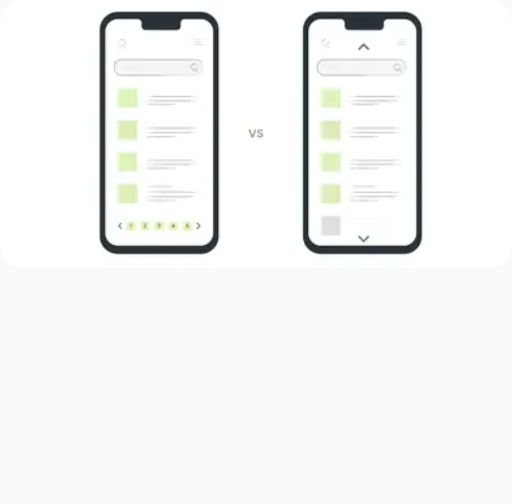
- `article[aria-labelledby="649d69e3280f442102ecbaf7-title"] > .gap-x-5.gap-y-2.md\:flex-row > .shrink-0.md\:w-1\/3`

	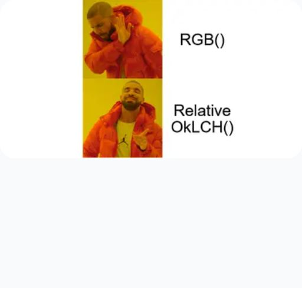
- `article[aria-labelledby="6494b136280f442102e4ee6b-title"] > .gap-x-5.gap-y-2.md\:flex-row > .shrink-0.md\:w-1\/3`

	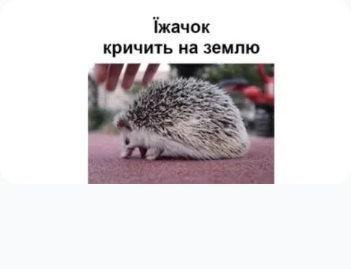
- `article[aria-labelledby="6491631f280f442102e0cdb3-title"] > .gap-x-5.gap-y-2.md\:flex-row > .shrink-0.md\:w-1\/3`

	
- `article[aria-labelledby="648c8be7280f442102da8e21-title"] > .gap-x-5.gap-y-2.md\:flex-row > .shrink-0.md\:w-1\/3`

	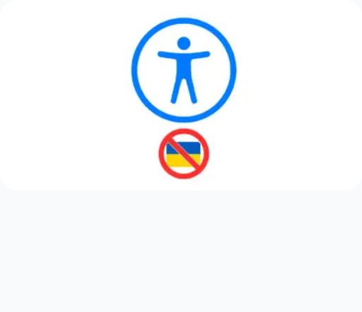
- `article[aria-labelledby="648c5888280f442102da3d40-title"] > .gap-x-5.gap-y-2.md\:flex-row > .shrink-0.md\:w-1\/3`

	
- `article[aria-labelledby="6470e3a3c149c83ef753c0b7-title"] > .gap-x-5.gap-y-2.md\:flex-row > .shrink-0.md\:w-1\/3`

	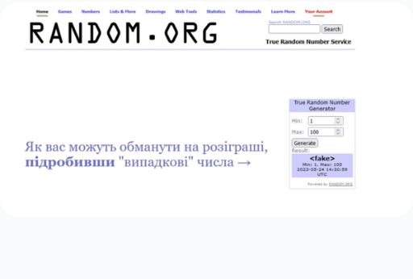
- `article[aria-labelledby="645903d1c149c83ef73715d8-title"] > .gap-x-5.gap-y-2.md\:flex-row > .shrink-0.md\:w-1\/3`

	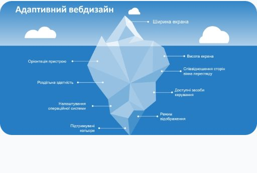
- `article[aria-labelledby="644e85be7305cb90edb048e8-title"] > .gap-x-5.gap-y-2.md\:flex-row > .shrink-0.md\:w-1\/3`

	

### Interactive controls must not be nested

Ensures interactive controls are not nested as they are not always announced by screen readers or can cause focus problems for assistive technologies

Impact: **serious**

Required to satisfy [WCAG 2.0 Level A](https://www.w3.org/TR/WCAG20/), [EN 301 549](https://www.etsi.org/deliver/etsi_en/301500_301599/301549/03.02.01_60/en_301549v030201p.pdf)

Need to fix one of the following issues:

- Element has focusable descendants.

Affected elements:

- `#headlessui-popover-button-405996`

	
- `#headlessui-popover-button-405998`

	

### Page should contain a level-one heading

Ensure that the page, or at least one of its frames contains a level-one heading

Impact: **moderate**

Need to fix all the following issues:

- Page must have a level-one heading.

Affected elements:

- html

